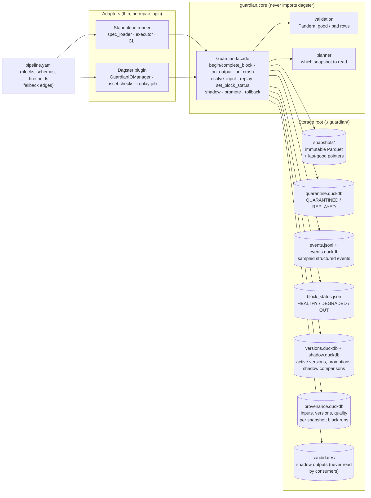

# Guardian

[](https://github.com/SaurabhDusane/guardian/actions/workflows/ci.yml)
[](https://github.com/SaurabhDusane/guardian/actions/workflows/nightly.yml)

Guardian attaches to an ETL pipeline, snapshots and validates every block's output, and
when a block fails keeps the pipeline running on last-good snapshots or declared fallback
sources while it quarantines the failing rows for replay once the block is fixed. The same
core runs as a standalone YAML-driven runner and as a Dagster plugin, with shadow
promotion for new block versions and an advisory LLM agent that diagnoses failures and
proposes fixes.

> Demo GIF placeholder (`docs/images/demo.gif`): one run where `b6_enrich` fails,
> `b8_aggregate` reroutes through its fallback, and `guardian replay` recovers the
> quarantined rows.

## Benchmarks

<!-- bench-results:start -->
_No results recorded yet for the current benchmark._ Run it on the machine you want to
quote, then fill in this table:

```bash
uv sync --extra observability
uv run python bench/run_bench.py              # 10k, 100k and 1M rows, 5 repeats each
uv run python bench/update_readme.py
```
<!-- bench-results:end -->

## Agent eval

<!-- agent-eval:start -->
_Not recorded yet: this table is filled from a real-model run of `guardian eval diagnose`
and `guardian eval propose` with `--real` (see [docs/agent.md](docs/agent.md#evaluation))._
<!-- agent-eval:end -->

Docs: [repair semantics](docs/repair-semantics.md) ·
[shadow promotion](docs/shadow-promotion.md) · [blast radius](docs/blast-radius.md) ·
[drift](docs/drift.md) · [agent](docs/agent.md) ·
[observability](docs/observability.md) · [benchmarks](docs/benchmarks.md) ·
[design decisions](docs/design-decisions.md) ·
[comparison with other tools](docs/comparison.md) · [development](docs/development.md)

## Quickstart

Requires Python 3.11+ and [uv](https://docs.astral.sh/uv/).

### Standalone

```bash
uv sync                                        # core + dev tools
uv run guardian run demo/pipeline.yaml         # run the demo; prints a per-block summary
uv run guardian status                         # health, last-good run, quarantine counts
uv run guardian set-status b6_enrich OUT       # take a block out for optimization
uv run guardian run demo/pipeline.yaml         # b8 now reads b5 through the fallback adapter
uv run guardian set-status b6_enrich HEALTHY
uv run guardian replay b2_parse                # re-run a (fixed) block on its quarantine
uv run guardian shadow start b6_enrich v2      # shadow a new version of any block
uv run guardian shadow status                  # ...then promote / rollback / stop
uv run guardian impact b5_normalize            # what did a degraded block touch?
uv run guardian lineage b8_aggregate <run_id>  # where did a snapshot come from?
uv run pytest                                  # fast default test suite
```

`demo/pipeline.yaml` is looked up in the working directory first, then inside the
installed package. Storage defaults to `./.guardian/` (`--root` changes it). `guardian
run` also takes `--run-id`, `--sample-rate`, `--fault` for fault injection, and
`--only BLOCK` to re-run selected blocks against the current last-good snapshots.

### Dagster

### Dagster

```bash
uv sync --extra dagster                        # or: uv pip install -e ".[dagster]"
uv run pytest -m dagster                       # the scenario suite under Dagster (slow)
```

In-process, from Python:

```python
from guardian.adapters.dagster.definitions import DEMO_SPEC, definitions_for
from guardian.adapters.dagster.io_manager import RUN_ID_TAG

defs = definitions_for(DEMO_SPEC, ".guardian")  # same YAML as the standalone runner
result = defs.resolve_job_def("guardian_pipeline").execute_in_process(tags={RUN_ID_TAG: "d1"})
for check in result.get_asset_check_evaluations():
    print(check.asset_key.to_user_string(), check.metadata["outcome"].value)

defs.resolve_job_def("guardian_replay").execute_in_process(
    run_config={"ops": {"guardian_replay_op": {"config": {"block": "b6_enrich"}}}}
)
```

With the Dagster UI (`dagster-webserver` comes with the extra):

```bash
GUARDIAN_ROOT=.guardian uv run dagster dev -m guardian.adapters.dagster.definitions
```

Every block is an asset with a `guardian_validation` check. `guardian_pipeline`
materializes all of them, and `guardian_replay` replays one block. Both modes share the
same storage format, so `guardian status --spec demo/pipeline.yaml --root <root>` works on a
root that Dagster wrote.

## Failure walkthrough

The demo pipeline turns messy e-commerce orders into daily revenue by region and
segment. `b8_aggregate` normally reads `b6_enrich`; while b6 is unhealthy it reads
`b5_normalize` through the adapter `b5_to_b6_shape` instead.

```bash
guardian run demo/pipeline.yaml --run-id r1                   # clean: every block passes
guardian run demo/pipeline.yaml --run-id r2 \
  --fault b6_enrich:corrupt:0.5:region,segment                # 50% of b6's rows corrupted
guardian status                                               # b6 DEGRADED, still serving r1
guardian replay b6_enrich                                     # 443 rows recovered, b6 HEALTHY
guardian run demo/pipeline.yaml --run-id r3 --only b8_aggregate
```

In r2, b6's output is rolled back and its last-good stays at r1. All 443 of its rows are
quarantined: the 222 corrupt ones under their failing rule, the rest under `rollback`
because the batch was rejected. b8 reads this run's b5 output through the adapter, so
revenue stays current and only the segment breakdown is lost. After the replay, re-running
b8 gives the same 130 rows as the clean run. The full walkthrough, with every command's
output and the same failure on a block without a fallback, is in
[docs/repair-semantics.md](docs/repair-semantics.md#walkthrough-heavy-corruption-in-one-block).

## How it works



| Layer | Modules | Responsibility |
|---|---|---|
| Core | `guardian/core/` | Models, validation, snapshot and quarantine stores, event log, reroute planner, version registry (`versions.py`), shadow comparison and policy (`shadow.py`), provenance, impact and lineage (`provenance.py`), `Guardian` facade. All repair and promotion semantics live here. |
| Standalone adapter | `guardian/runner/` | YAML → `PipelineSpec` (DAG checks), topological executor, `guardian` CLI. |
| Dagster adapter | `guardian/adapters/dagster/` | IO manager (`handle_output` → core, `load_input` → `resolve_input`), `guardian_validation` and `guardian_shadow` asset checks, `guardian_replay` job, `Definitions` built from the same YAML. |
| Demo | `guardian/demo/` | Messy synthetic orders behind a `DatasetLoader` interface, blocks b1–b8 (every DAG role is represented), schemas, fault injection. |

## Why I built this

<!-- SAURABH: write this -->
<!-- Note: the origin of the project, starting from the handwritten sketch (image to go in docs/images/origin-sketch.jpg). -->

## How this was built

<!-- SAURABH: write this -->
<!-- Note: the design was yours, the implementation was done with Claude Code, and each phase was verified before the next. -->
