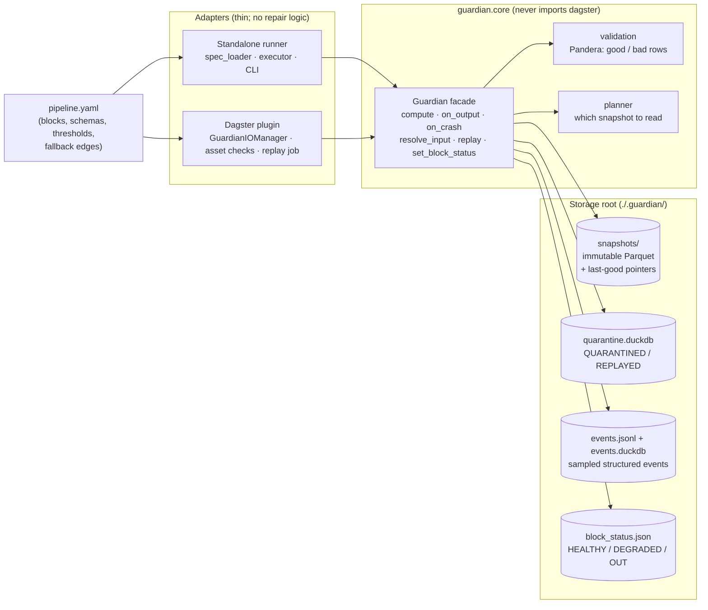

# Guardian

Guardian is a self-healing maintenance layer that attaches to an existing ETL pipeline.
It snapshots every block's output and validates it. When a block goes bad, the
pipeline keeps flowing instead of stopping: consumers are rolled back to the
block's last-good snapshot, failing records are quarantined (never dropped), and
dependents are rerouted through declared fallback edges. Once the block is fixed,
its quarantined records are replayed into a new snapshot. The same core runs as a
standalone YAML-driven DAG runner and as a Dagster plugin, and both modes run the
identical pipeline spec.

## Architecture



| Layer | Modules | Responsibility |
|---|---|---|
| Core | `guardian/core/` | Models, validation, snapshot and quarantine stores, event log, reroute planner, `Guardian` facade. All repair semantics live here. |
| Standalone adapter | `guardian/runner/` | YAML → `PipelineSpec` (DAG checks), topological executor, `guardian` CLI. |
| Dagster adapter | `guardian/adapters/dagster/` | IO manager (`handle_output` → core, `load_input` → `resolve_input`), `guardian_validation` asset checks, `guardian_replay` job, `Definitions` built from the same YAML. |
| Demo | `guardian/demo/` | Messy synthetic orders behind a `DatasetLoader` interface, blocks b1–b8 (every DAG role is represented), schemas, fault injection. |

## Quickstart

Requires Python 3.11+ and [uv](https://docs.astral.sh/uv/).

### Standalone

```bash
uv sync                                        # core + dev tools
uv run guardian run demo/pipeline.yaml         # run the demo; prints a per-block summary
uv run guardian status                         # health, last-good run, quarantine counts
uv run guardian set-status b6_enrich OUT       # take a block out for optimization
uv run guardian run demo/pipeline.yaml         # b8 now reads b5 through the fallback adapter
uv run guardian set-status b6_enrich HEALTHY
uv run guardian replay b2_parse                # re-run a (fixed) block on its quarantine
uv run pytest                                  # unit tests + scenario suite
```

`demo/pipeline.yaml` is looked up in the working directory first, then inside the
installed package, so the command works from anywhere. Storage defaults to `./.guardian/`
(use `--root` to change it). `guardian run` also takes `--run-id`, `--sample-rate`, and
`--fault` for fault injection, and `--only BLOCK` to re-run selected blocks against the
current last-good snapshots (see the walkthrough below).

### Dagster

```bash
uv sync --extra dagster                        # or: uv pip install -e ".[dagster]"
uv run pytest                                  # scenario suite now also runs under Dagster
```

In-process, from Python:

```python
from guardian.adapters.dagster.definitions import DEMO_SPEC, definitions_for
from guardian.adapters.dagster.io_manager import RUN_ID_TAG

defs = definitions_for(DEMO_SPEC, ".guardian")  # same YAML as the standalone runner
result = defs.resolve_job_def("guardian_pipeline").execute_in_process(tags={RUN_ID_TAG: "d1"})
for check in result.get_asset_check_evaluations():
    print(check.asset_key.to_user_string(), check.metadata["outcome"].value)

defs.resolve_job_def("guardian_replay").execute_in_process(
    run_config={"ops": {"guardian_replay_op": {"config": {"block": "b6_enrich"}}}}
)
```

With the Dagster UI (`dagster-webserver` comes with the extra):

```bash
GUARDIAN_ROOT=.guardian uv run dagster dev -m guardian.adapters.dagster.definitions
```

Every block is an asset with a `guardian_validation` check. `guardian_pipeline`
materializes all of them, and `guardian_replay` replays one block. Both modes share the
same storage format, so `guardian status --spec demo/pipeline.yaml --root <root>` works on a
root that Dagster wrote.

## Repair semantics

Every adapter must honor the following contract, and the scenario suite enforces it for
both runners.

**On a block's output: `on_output(block, run_id, df) -> Decision`**

1. Validate `df` against the block's Pandera schema. Rows are split into good and bad,
   and each bad row gets a `rule_name` and a `reason`. A frame-level failure (a missing
   column, a frame-wide check) is a *schema-level* failure.
2. Bad rows go to quarantine with `block, run_id, rule_name, reason, ts, status`
   (`QUARANTINED`) and the original row as `payload_json`.
3. If the bad-row fraction is at or below the block's `quarantine_threshold`, the good
   rows are written as the immutable snapshot `(block, run_id)` and promoted to
   last-good. The block becomes `HEALTHY` and the decision is **PASS**.
4. Above the threshold, or on a schema-level failure, nothing is promoted. The block
   becomes `DEGRADED` and the decision is **ROLLBACK**, so consumers keep reading the
   previous last-good snapshot. The rows that were still good are quarantined too
   (rule `rollback`) so nothing is lost.
5. If the block function raises (or does not return a DataFrame), the result is
   **ROLLBACK** with reason `crash`.

**On a consumer's input: `resolve_input(block, upstream) -> DataRef`**

| Upstream status | Fallback edge for (block, upstream)? | Reads |
|---|---|---|
| `HEALTHY` | n/a | upstream's latest last-good snapshot |
| `DEGRADED` or `OUT` | yes, and the fallback source is `HEALTHY` with a last-good | the fallback source's last-good, passed through the edge's `adapter` |
| `DEGRADED` or `OUT` | no, or the fallback source is itself `DEGRADED`/`OUT` (or has no snapshot) | upstream's last-good, marked `stale`, with **no** adapter |
| `DEGRADED` or `OUT` | upstream has no last-good either | `NoSafeInputError`; the block is reported `BLOCKED` and the rest of the pipeline continues |
| `HEALTHY` | upstream has never been promoted | `NoSafeInputError` (as above) |

An unhealthy fallback source is never used, even if it has a snapshot: when several
blocks are unhealthy at once, a consumer falls back to stale data from the block it
actually depends on. A source block (no inputs) that is `DEGRADED` or `OUT` needs no
special case: its dependents follow the same table.

Every resolution emits a `RESOLVE` or `REROUTE` event naming the source actually read.

**Recovery**

- `replay(block)` re-runs the block's (fixed) function on its `QUARANTINED` records and
  validates the result. Records whose rows now pass are marked `REPLAYED`; the rest stay
  `QUARANTINED`. Records are never deleted. The result reports `replayed` and
  `still_failing`. Where the recovered rows go depends on the block's `merge_key`:
  - **With a `merge_key`** (for example `merge_key: [order_id]` in the YAML), the
    recovered rows are *upserted* into a copy of the last-good snapshot. On a key
    conflict the replayed row wins, and among replayed rows the newest quarantine record
    wins. The result is written as a new snapshot and promoted to last-good, and the
    block becomes `HEALTHY`.
  - **Without one**, Guardian cannot tell a correction from a duplicate, so it does not
    merge. The recovered rows are written to their own snapshot, last-good is left
    unchanged, and a `WARN` event says the merge was skipped.
- Replay is **idempotent**. It only consumes `QUARANTINED` records, so running it again
  finds nothing to do and changes nothing. A replay that dies after writing its snapshot
  but before marking records can simply be re-run: the keyed upsert produces the same
  rows, not duplicates.
- `set_block_status(block, HEALTHY | OUT)` is the human control. An `OUT` block is
  skipped and its consumers reroute. `DEGRADED` is only ever set by Guardian.

**Events.** Structured JSON events go to `events.jsonl` and a DuckDB table. Routine
events are sampled at `--sample-rate`, while `WARN`, `ERROR`, `ROLLBACK`, `REROUTE` and
`QUARANTINE` are always kept.

## Walkthrough: heavy corruption in one block (scenario 3)

The demo pipeline turns messy e-commerce orders into daily revenue by region and
customer segment, plus a per-customer summary:

```
b1_ingest → b2_parse → b3_standardize → b4_clean → b5_normalize ─┬→ b6_enrich → b8_aggregate
                                                                  │      └─ fallback for b6 ─┘
                                                                  │         (adapter b5_to_b6_shape)
                                                                  └→ b7_customers
```

**This walkthrough uses b6, but nothing in Guardian is specific to b6.** Every command
takes the block name as an argument and works for any block in the spec. What happens to
a failing block's dependents depends only on its role in the DAG: a fallback edge that
replaces it, no fallback, or no dependents at all. The scenario suite runs the same
failures against one block of every role (see [Testing by DAG role](#testing-by-dag-role)),
and [a second example below](#the-same-flow-on-another-block-b2_parse) runs the flow on
`b2_parse`, which has no fallback.

**1. A normal run.** The raw data is deliberately messy: the 57 rows quarantined in b1–b4
fall under their thresholds, so every block passes.

```
$ guardian run demo/pipeline.yaml --run-id r1
                                    Pipeline 'demo' - run r1
┏━━━━━━━━━━━━━━━━┳━━━━━━━━━┳━━━━━━━━━┳━━━━━━━━━┳━━━━━━━━━━┳━━━━━━━━━━━━━┳━━━━━━━━━━━━━━━━┳━━━━━━┓
┃ block          ┃ outcome ┃ status  ┃ rows in ┃ promoted ┃ quarantined ┃ read from      ┃ note ┃
┡━━━━━━━━━━━━━━━━╇━━━━━━━━━╇━━━━━━━━━╇━━━━━━━━━╇━━━━━━━━━━╇━━━━━━━━━━━━━╇━━━━━━━━━━━━━━━━╇━━━━━━┩
│ b1_ingest      │ PASS    │ HEALTHY │       0 │      498 │           2 │ -              │      │
│ b2_parse       │ PASS    │ HEALTHY │     498 │      475 │          23 │ b1_ingest      │      │
│ b3_standardize │ PASS    │ HEALTHY │     475 │      462 │          13 │ b2_parse       │      │
│ b4_clean       │ PASS    │ HEALTHY │     462 │      443 │          19 │ b3_standardize │      │
│ b5_normalize   │ PASS    │ HEALTHY │     443 │      443 │           0 │ b4_clean       │      │
│ b6_enrich      │ PASS    │ HEALTHY │     443 │      443 │           0 │ b5_normalize   │      │
│ b7_customers   │ PASS    │ HEALTHY │     443 │      115 │           0 │ b5_normalize   │      │
│ b8_aggregate   │ PASS    │ HEALTHY │     443 │      130 │           0 │ b6_enrich      │      │
└────────────────┴─────────┴─────────┴─────────┴──────────┴─────────────┴────────────────┴──────┘
run r1: 8 blocks, 57 rows quarantined. Storage: .guardian
```

**2. b6 goes bad.** We inject a fault that corrupts the `region` and `segment` columns
in 50% of b6's output. That is far above b6's 10% threshold.

```
$ guardian run demo/pipeline.yaml --run-id r2 --fault b6_enrich:corrupt:0.5:region,segment
                                                     Pipeline 'demo' - run r2
┏━━━━━━━━━━━━━━━━┳━━━━━━━━━━┳━━━━━━━━━━┳━━━━━━━━━┳━━━━━━━━━━┳━━━━━━━━━━━━━┳━━━━━━━━━━━━━━━━━━━━━━━━━━━┳━━━━━━━━━━━━━━━━━━━━━━━━━━┓
┃ block          ┃ outcome  ┃ status   ┃ rows in ┃ promoted ┃ quarantined ┃ read from                 ┃ note                     ┃
┡━━━━━━━━━━━━━━━━╇━━━━━━━━━━╇━━━━━━━━━━╇━━━━━━━━━╇━━━━━━━━━━╇━━━━━━━━━━━━━╇━━━━━━━━━━━━━━━━━━━━━━━━━━━╇━━━━━━━━━━━━━━━━━━━━━━━━━━┩
│ b1_ingest      │ PASS     │ HEALTHY  │       0 │      498 │           2 │ -                         │                          │
│ b2_parse       │ PASS     │ HEALTHY  │     498 │      475 │          23 │ b1_ingest                 │                          │
│ b3_standardize │ PASS     │ HEALTHY  │     475 │      462 │          13 │ b2_parse                  │                          │
│ b4_clean       │ PASS     │ HEALTHY  │     462 │      443 │          19 │ b3_standardize            │                          │
│ b5_normalize   │ PASS     │ HEALTHY  │     443 │      443 │           0 │ b4_clean                  │                          │
│ b6_enrich      │ ROLLBACK │ DEGRADED │     443 │        0 │         443 │ b5_normalize              │ bad-row fraction 0.5011  │
│                │          │          │         │          │             │                           │ exceeds threshold 0.1    │
│ b7_customers   │ PASS     │ HEALTHY  │     443 │      115 │           0 │ b5_normalize              │                          │
│ b8_aggregate   │ PASS     │ HEALTHY  │     443 │       98 │           0 │ b5_normalize (fallback    │                          │
│                │          │          │         │          │             │ for b6_enrich)            │                          │
└────────────────┴──────────┴──────────┴─────────┴──────────┴─────────────┴───────────────────────────┴──────────────────────────┘
run r2: 8 blocks, 500 rows quarantined. Storage: .guardian
```

This single run shows all three repair actions:

- **Rollback.** b6's r2 output is not promoted, and b6's last-good stays at r1.
- **Quarantine.** All 443 rows are kept. The 222 corrupt rows are stored under rule
  `region:isin(['NA', 'EU'])`, and the other 221 under `rollback` because the batch as a
  whole was rejected.
- **Reroute.** b8 reads *this run's* b5 output through `b5_to_b6_shape`, so the revenue
  numbers are current. Only the segment breakdown is lost: segments are `unassigned` on
  that path, which is why b8 has 98 rows instead of 130. b7 does not depend on b6 and is
  unaffected.

The event log records why:

```json
{"kind": "ROLLBACK", "block": "b6_enrich", "run_id": "r2",
 "data": {"reason": "bad-row fraction 0.5011 exceeds threshold 0.1", "last_good_run_id": "r1"}}
{"kind": "QUARANTINE", "block": "b6_enrich", "run_id": "r2",
 "data": {"rows": 443, "rules": {"region:isin(['NA', 'EU'])": 222, "rollback": 221}}}
{"kind": "REROUTE", "block": "b8_aggregate", "run_id": "r2",
 "data": {"upstream": "b6_enrich", "upstream_status": "DEGRADED", "source": "b5_normalize",
          "source_run_id": "r2", "adapter": "demo.blocks:b5_to_b6_shape", "stale": false}}
```

**3. Status.** b6 is `DEGRADED`, still serving r1, with 443 rows waiting in quarantine.
(The counts for b1–b4 add up over both runs.)

```
$ guardian status
┏━━━━━━━━━━━━━━━━┳━━━━━━━━━━┳━━━━━━━━━━━━━━━┳━━━━━━━━━━━━━┳━━━━━━━━━━┓
┃ block          ┃ status   ┃ last-good run ┃ quarantined ┃ replayed ┃
┡━━━━━━━━━━━━━━━━╇━━━━━━━━━━╇━━━━━━━━━━━━━━━╇━━━━━━━━━━━━━╇━━━━━━━━━━┩
│ b1_ingest      │ HEALTHY  │ r2            │ 4           │ 0        │
│ b2_parse       │ HEALTHY  │ r2            │ 46          │ 0        │
│ b3_standardize │ HEALTHY  │ r2            │ 26          │ 0        │
│ b4_clean       │ HEALTHY  │ r2            │ 38          │ 0        │
│ b5_normalize   │ HEALTHY  │ r2            │ 0           │ 0        │
│ b6_enrich      │ DEGRADED │ r1            │ 443         │ 0        │
│ b7_customers   │ HEALTHY  │ r2            │ 0           │ 0        │
│ b8_aggregate   │ HEALTHY  │ r2            │ 0           │ 0        │
└────────────────┴──────────┴───────────────┴─────────────┴──────────┘
```

**4. Fix and replay.** The fault was only for that run, so the "fixed" b6 is simply the
real one. Replay re-derives `region` and `segment` from the intact columns, and all 443
records pass. b6 declares `merge_key: [order_id]`, so the recovered rows are upserted into
b6's last-good snapshot (r1). r1 and r2 contain the same generated orders, so every
recovered row replaces its r1 version, and the new snapshot has 443 rows with unique
`order_id`s, not 886. A second replay has nothing left to do:

```
$ guardian replay b6_enrich
b6_enrich: replayed 443, still failing 0, upserted into new last-good snapshot replay-20260926T044256-18041e

$ guardian replay b6_enrich
b6_enrich: replayed 0, still failing 0 (nothing to replay)

$ guardian status
│ b6_enrich      │ HEALTHY │ replay-20260926T044256-18041e │ 0           │ 443      │
```

b6 is `HEALTHY` again, with a new promoted snapshot. Its 443 records are still in
quarantine, now marked `REPLAYED`.

**5. Refresh b8.** b8's r2 output was computed on the fallback path. Re-running just b8
reads the recovered b6 snapshot, and the result is identical to the clean r1 aggregates:
the same 130 rows with the same values. The scenario suite asserts this under both runners
for the fallback-protected block's descendants
(`test_descendants_after_replay_match_clean_run`).

```
$ guardian run demo/pipeline.yaml --run-id r3 --only b8_aggregate
                                                Pipeline 'demo' - run r3
┏━━━━━━━━━━━━━━┳━━━━━━━━━┳━━━━━━━━━┳━━━━━━━━━┳━━━━━━━━━━┳━━━━━━━━━━━━━┳━━━━━━━━━━━━━━━━━━━━━━━━━━━━━━━━━━━━━━━━━┳━━━━━━┓
┃ block        ┃ outcome ┃ status  ┃ rows in ┃ promoted ┃ quarantined ┃ read from                               ┃ note ┃
┡━━━━━━━━━━━━━━╇━━━━━━━━━╇━━━━━━━━━╇━━━━━━━━━╇━━━━━━━━━━╇━━━━━━━━━━━━━╇━━━━━━━━━━━━━━━━━━━━━━━━━━━━━━━━━━━━━━━━━╇━━━━━━┩
│ b8_aggregate │ PASS    │ HEALTHY │     443 │      130 │           0 │ b6_enrich@replay-20260926T044256-18041e │      │
└──────────────┴─────────┴─────────┴─────────┴──────────┴─────────────┴─────────────────────────────────────────┴──────┘
run r3: 1 blocks, 0 rows quarantined. Storage: .guardian
```

> **Note: replay needs a `merge_key` to merge.** Without one, replay does not append
> (appending would have duplicated all 443 orders here). It writes the recovered rows to
> a separate snapshot, leaves last-good alone, and warns:
>
> ```
> $ guardian replay b6_enrich
> b6_enrich: replayed 443, still failing 0
> WARN: no merge_key declared; replayed rows written to separate snapshot replay-20260926T022401-2c26b9, last-good unchanged
> ```
>
> The matching `WARN` event, which is never sampled out, records the snapshot name and the
> unchanged last-good run. Every demo block declares a `merge_key`.

The same scenario runs under Dagster in `tests/scenarios`. There, the failing block's
`guardian_validation` check fails with `outcome=ROLLBACK`, and its dependents' inputs are
resolved by the IO manager.

### The same flow on another block: b2_parse

b2 has no fallback edge (role `unprotected`), so when it crashes its dependent b3 reads
b2's last-good snapshot, marked `(stale)`, with no adapter. Everything downstream still
runs, on data that is one run old at b2:

```
$ guardian run demo/pipeline.yaml --run-id r4 --fault b2_parse:crash
                                        Pipeline 'demo' - run r4
┏━━━━━━━━━━━━━━━━┳━━━━━━━━━━┳━━━━━━━━━━┳━━━━━━━━━┳━━━━━━━━━━┳━━━━━━━━━━━━━┳━━━━━━━━━━━━━━━━━━━━━┳━━━━━━━┓
┃ block          ┃ outcome  ┃ status   ┃ rows in ┃ promoted ┃ quarantined ┃ read from           ┃ note  ┃
┡━━━━━━━━━━━━━━━━╇━━━━━━━━━━╇━━━━━━━━━━╇━━━━━━━━━╇━━━━━━━━━━╇━━━━━━━━━━━━━╇━━━━━━━━━━━━━━━━━━━━━╇━━━━━━━┩
│ b1_ingest      │ PASS     │ HEALTHY  │       0 │      498 │           2 │ -                   │       │
│ b2_parse       │ ROLLBACK │ DEGRADED │     498 │        0 │           0 │ b1_ingest           │ crash │
│ b3_standardize │ PASS     │ HEALTHY  │     475 │      462 │          13 │ b2_parse@r2 (stale) │       │
│ b4_clean       │ PASS     │ HEALTHY  │     462 │      443 │          19 │ b3_standardize      │       │
│ b5_normalize   │ PASS     │ HEALTHY  │     443 │      443 │           0 │ b4_clean            │       │
│ b6_enrich      │ PASS     │ HEALTHY  │     443 │      443 │           0 │ b5_normalize        │       │
│ b7_customers   │ PASS     │ HEALTHY  │     443 │      115 │           0 │ b5_normalize        │       │
│ b8_aggregate   │ PASS     │ HEALTHY  │     443 │      130 │           0 │ b6_enrich           │       │
└────────────────┴──────────┴──────────┴─────────┴──────────┴─────────────┴─────────────────────┴───────┘
run r4: 8 blocks, 34 rows quarantined. Storage: .guardian
```

b2 is `DEGRADED` and nothing was quarantined, because a crash produces no rows. Once b2
is fixed (here: the next run without the fault), it passes, returns to `HEALTHY`, and b3
reads it fresh again. `guardian replay b2_parse` works the same way as for b6 whenever b2
has quarantined rows.

## Design decisions

### Why the core is orchestrator-agnostic

The value of Guardian is in its repair semantics: when to promote, what to quarantine,
which snapshot a consumer reads. Those semantics should not depend on who schedules the
blocks. `guardian.core` is plain Python over pandas, Pandera, Parquet and DuckDB. It
never imports dagster, and a layering test (`tests/unit/test_layering.py`) enforces
that. Each adapter only maps its orchestrator's hooks onto the `Guardian` facade:

- The standalone executor calls `resolve_input`, `compute` and `handle_result` in
  topological order.
- The Dagster IO manager calls the same methods from `load_input` and `handle_output`.

This means a third orchestrator (Airflow, Prefect) needs a thin adapter, not a
reimplementation. It also makes the contract testable once for all modes: the scenario
suite is parametrized over a runner fixture, and every scenario, including the
no-silent-loss check, runs unchanged against both runners. When the Dagster adapter
needed crash handling, that logic went into core (`Guardian.compute` returns a
`BlockCrash` value), and the standalone runner now uses it too.

### Why rerouting happens at the data level in Dagster

Dagster's graph is static: the edge b6 → b8 exists whether b6 is healthy or not, and a
failed step makes Dagster skip everything downstream. Rerouting by rewriting the graph
(conditional branches, dynamic outputs, alternate jobs) would mean a different Dagster
job per failure combination. The degraded path would also look different from the
healthy one in the UI and in lineage.

Instead, Guardian leaves the asset graph as declared and reroutes where the data is read.
`GuardianIOManager.load_input` asks core which snapshot b8 should actually read: b6's
last-good, b5's snapshot through the adapter, or a stale copy. A failing block does not
fail its step. `Guardian.compute` catches the crash, the IO manager records the
rollback, and the step completes so that downstream assets still run. Fallback sources are
declared as extra `deps`, so they are always materialized before the consumer that might
need them.

The cost is that Dagster records a successful materialization for a block that Guardian
rolled back or skipped. The truth is carried by the `guardian_validation` asset check
(failed, severity ERROR, with outcome, reason, row counts and threshold) and by
`guardian_action` output metadata. This is a deliberate trade: the pipeline keeps flowing,
and the UI still shows exactly which block is degraded and why.

### The no-silent-loss invariant (exactly once)

> Every row handed to `on_output` ends up in exactly one place: the promoted snapshot for
> that run, or quarantine. After a replay, a `REPLAYED` row is held by the replay
> snapshot its record points at. So at any moment each input row is held exactly once,
> across promoted snapshots plus un-replayed quarantine.

Guardian can only be trusted to act automatically if it never makes data disappear. Two
design choices follow from the invariant:

- **Rejected batches quarantine every row.** On a rollback, the rows that were still
  valid are also quarantined (rule `rollback`). Otherwise they would be in neither place.
  Replay brings them back.
- **Quarantine is append-only.** Replay changes a record's status from `QUARANTINED` to
  `REPLAYED` and never deletes it, so every recovery can be audited.
- **Replay merges by key or not at all.** Appending recovered rows to a snapshot that
  may already hold an earlier version of the same row would satisfy "no loss" but break
  "exactly once". Upserting by `merge_key` satisfies both, and it also makes replay
  idempotent.

The invariant is tested at three levels:

- **Property tests** (`tests/unit/test_invariant.py`, hypothesis) generate random frames
  with random bad rows, NaNs, text that can't be converted, repeated index labels and
  missing columns, across thresholds.
  - The first test checks that the promoted plus quarantined row ids exactly equal the
    input ids.
  - The second then fixes the block and replays twice, with and without a `merge_key`,
    and with and without an earlier run to merge into. After every step, each input id
    of each run must be held exactly once. The second replay must not write anything.
- **Per-block check in every scenario:** for each block, rows handed over = promoted +
  quarantined. This is read back from the stored events, snapshots and quarantine, so it
  does not trust the runner's own report. A second check, by `merge_key`, confirms that
  no row is held twice, including rows that were replayed.
- **Chain checks in every scenario:** for row-wise blocks, the rows a block received
  equal the rows of the snapshot it read. End to end, every ingested row is either in
  the final snapshot or quarantined somewhere upstream.

### Testing by DAG role

Guardian's code never names a block: every behaviour comes from the spec. The tests follow
the same rule. `tests/helpers/roles.py` classifies every block of a spec by its role in
the DAG:

| Role | Meaning | Demo block used |
|---|---|---|
| `source` | no inputs | b1_ingest |
| `leaf` | no dependents | b7_customers (b8 also qualifies) |
| `fallback_protected` | a dependent has a fallback edge replacing it | b6_enrich |
| `unprotected` | has dependents, none with a fallback edge replacing it | b2_parse (b1–b5 qualify) |
| `fallback_source` | is the source of some fallback edge | b5_normalize |
| `multi_dependent` | two or more dependents | b5_normalize |

`representative(spec, role)` picks the block with the fewest other roles. The minor
corruption, heavy failure (corruption and schema drift), crash, taken-OUT and replay
scenarios each run once per role, under both runners. Expectations are derived from the
spec, not written per block:

- **All roles:** every other block passes on this run's data.
- **Dependents:** a dependent with a healthy fallback edge reads through the adapter;
  any other dependent reads `STALE` data.
- **Leaf:** nothing reroutes.
- **Replay:** faults corrupt only the columns a block derives itself. Replay recovers
  every row the fixed block can re-derive, recovers the rolled-back batch's collateral
  rows for every role, and leaves the rest quarantined.

The multi-failure rules (the fallback source is unhealthy too; no last-good anywhere)
have their own scenarios. The demo spec contains every role;
`tests/unit/test_roles.py` checks that.

## Results

Demo pipeline at 100,000 generated rows, 5 runs per configuration, measured before
`b7_customers` was added to the demo (so the pipeline had 7 blocks), on a 4-core Intel Xeon
@ 2.10 GHz cloud container (Python 3.11, pandas 3.0, DuckDB 1.5). The figures are medians
with the min to max range. Full details, machine specs and raw samples are in
[`bench/results.md`](bench/results.md); reproduce with `uv run python bench/run_bench.py`
(`--rows`, `--reps`).

| Metric | Setup | Result |
|---|---|---|
| Throughput during outage | Rows/s through the whole pipeline while b6 crashes on every run and b8 is rerouted to b5, vs. a clean run. The same 87,517 rows reach b8 in both. | **23,362 rows/s** during the outage (22,322 to 23,648) vs. **22,358 rows/s** clean (22,150 to 22,620): **104%** of the clean run. There is no throughput penalty; b6's own work is skipped. |
| Recovery time | Time for `replay b6_enrich` after a heavy-corruption outage (87,517 quarantined rows), until b6 is HEALTHY with the upserted snapshot promoted. | **2.55 s** in-process (2.47 to 2.60). **3.72 s** via the CLI (3.68 to 4.36), which includes starting Python and importing pandas, Pandera, pyarrow and DuckDB. |
| Logging overhead | The same blocks on clean data, with Guardian at event sample rate 1.0 and 0.1, vs. a bare run without Guardian. | Bare **2.67 s**. Guardian **3.41 s** at 1.0 and **3.41 s** at 0.1, so **+28%** in total (validation, Parquet snapshots, bookkeeping). The logging share (1.0 vs. 0.1) is **+1 ms**, below the ±73 ms run-to-run spread. A run emits only 36 events, per block and decision rather than per row. |

**Reading the numbers**
- **Outage throughput:** reading b5 through the adapter costs no more than running b6, so
  the pipeline delivers at full speed during the outage. What degrades is data richness
  (segments are `unassigned`), not throughput.
- **Recovery:** replaying about 88k rows is a few seconds, dominated by re-running b6 and
  validating the recovered rows.
- **Overhead:** Guardian's cost comes from validation and snapshots, not from logging.
  At this event volume the sample rate hardly matters; it would start to matter only with
  far more blocks or with per-row events.

## Project layout

```
guardian/
  core/        models, validation, snapshots, quarantine, events, planner, guardian facade
  runner/      spec_loader, executor, cli
  adapters/dagster/  io_manager, checks, replay, definitions
  demo/        data_gen, schemas, blocks, faults, pipeline.yaml
bench/
  run_bench.py throughput / recovery / overhead benchmarks -> bench/results.md
tests/
  helpers/     blocks_by_role (DAG roles) and block profiles, shared by the tests
  unit/        per-module core tests, invariant property test, layering test, role helper
  runner/      spec loader, executor, CLI
  demo/        demo blocks and fault injection
  adapters/    Dagster adapter wiring
  scenarios/   fault-injection suite, parametrized over DAG roles and both runners
  bench/       smoke test for the benchmark script
```
