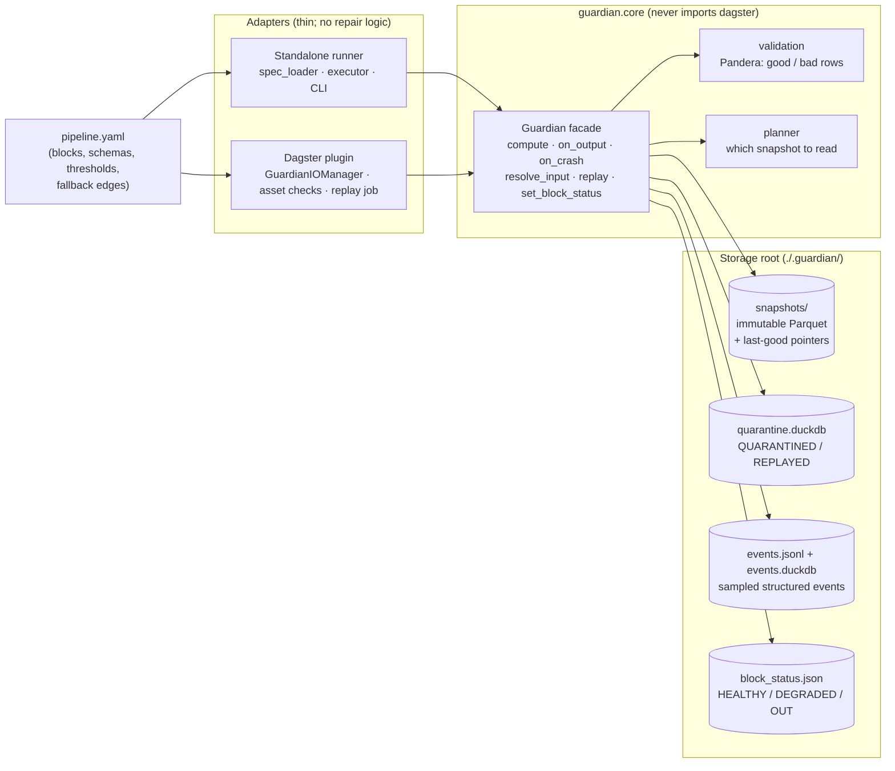

# Guardian

Guardian is a self-healing maintenance layer that attaches to an existing ETL pipeline.
It snapshots every block's output and validates it. When a block goes bad, the
pipeline keeps flowing instead of stopping: consumers are rolled back to the
block's last-good snapshot, failing records are quarantined (never dropped), and
dependents are rerouted through declared fallback edges. Once the block is fixed,
its quarantined records are replayed into a new snapshot. The same core runs as a
standalone YAML-driven DAG runner and as a Dagster plugin, and both modes run the
identical pipeline spec.

## Architecture



| Layer | Modules | Responsibility |
|---|---|---|
| Core | `guardian/core/` | Models, validation, snapshot and quarantine stores, event log, reroute planner, `Guardian` facade. All repair semantics live here. |
| Standalone adapter | `guardian/runner/` | YAML → `PipelineSpec` (DAG checks), topological executor, `guardian` CLI. |
| Dagster adapter | `guardian/adapters/dagster/` | IO manager (`handle_output` → core, `load_input` → `resolve_input`), `guardian_validation` asset checks, `guardian_replay` job, `Definitions` built from the same YAML. |
| Demo | `guardian/demo/` | Messy synthetic orders behind a `DatasetLoader` interface, blocks b1–b6 and b8, schemas, fault injection. |

## Quickstart

Requires Python 3.11+ and [uv](https://docs.astral.sh/uv/).

### Standalone

```bash
uv sync                                        # core + dev tools
uv run guardian run demo/pipeline.yaml         # run the demo; prints a per-block summary
uv run guardian status                         # health, last-good run, quarantine counts
uv run guardian set-status b6_enrich OUT       # take a block out for optimization
uv run guardian run demo/pipeline.yaml         # b8 now reads b5 through the fallback adapter
uv run guardian set-status b6_enrich HEALTHY
uv run guardian replay b2_parse                # re-run a (fixed) block on its quarantine
uv run pytest                                  # unit tests + scenario suite
```

`demo/pipeline.yaml` is looked up in the working directory first, then inside the
installed package, so the command works from anywhere. Storage defaults to `./.guardian/`
(use `--root` to change it). `guardian run` also takes `--run-id`, `--sample-rate`, and
`--fault` for fault injection (see the walkthrough below).

### Dagster

```bash
uv sync --extra dagster                        # or: uv pip install -e ".[dagster]"
uv run pytest                                  # scenario suite now also runs under Dagster
```

In-process, from Python:

```python
from guardian.adapters.dagster.definitions import DEMO_SPEC, definitions_for
from guardian.adapters.dagster.io_manager import RUN_ID_TAG

defs = definitions_for(DEMO_SPEC, ".guardian")          # same YAML as the standalone runner
result = defs.resolve_job_def("guardian_pipeline").execute_in_process(tags={RUN_ID_TAG: "d1"})
for check in result.get_asset_check_evaluations():
    print(check.asset_key.to_user_string(), check.metadata["outcome"].value)

defs.resolve_job_def("guardian_replay").execute_in_process(
    run_config={"ops": {"guardian_replay_op": {"config": {"block": "b6_enrich"}}}}
)
```

With the Dagster UI (needs `dagster-webserver`, which the extra does not include):

```bash
uv pip install dagster-webserver
GUARDIAN_ROOT=.guardian uv run dagster dev -m guardian.adapters.dagster.definitions
```

Every block is an asset with a `guardian_validation` check. `guardian_pipeline`
materializes all of them, and `guardian_replay` replays one block. Both modes share the
same storage format, so `guardian status --spec demo/pipeline.yaml --root <root>` works on a
root that Dagster wrote.

## Repair semantics

Every adapter must honor the following contract, and the scenario suite enforces it for
both runners.

**On a block's output: `on_output(block, run_id, df) -> Decision`**

1. Validate `df` against the block's Pandera schema. Rows are split into good and bad,
   and each bad row gets a `rule_name` and a `reason`. A frame-level failure (a missing
   column, a frame-wide check) is a *schema-level* failure.
2. Bad rows go to quarantine with `block, run_id, rule_name, reason, ts, status`
   (`QUARANTINED`) and the original row as `payload_json`.
3. If the bad-row fraction is at or below the block's `quarantine_threshold`, the good
   rows are written as the immutable snapshot `(block, run_id)` and promoted to
   last-good. The block becomes `HEALTHY` and the decision is **PASS**.
4. Above the threshold, or on a schema-level failure, nothing is promoted. The block
   becomes `DEGRADED` and the decision is **ROLLBACK**, so consumers keep reading the
   previous last-good snapshot. The rows that were still good are quarantined too
   (rule `rollback`) so nothing is lost.
5. If the block function raises (or does not return a DataFrame), the result is
   **ROLLBACK** with reason `crash`.

**On a consumer's input: `resolve_input(block, upstream) -> DataRef`**

| Upstream status | Fallback edge for (block, upstream)? | Reads |
|---|---|---|
| `HEALTHY` | n/a | upstream's latest last-good snapshot |
| `DEGRADED` or `OUT` | yes, and the source has a last-good | the fallback source's last-good, passed through the edge's `adapter` |
| `DEGRADED` or `OUT` | no (or the source has no snapshot) | upstream's last-good, marked `stale` |
| any | nothing above exists | `NoSafeInputError`; the block is reported `BLOCKED` and the rest of the pipeline continues |

Every resolution emits a `RESOLVE` or `REROUTE` event naming the source actually read.

**Recovery**

- `replay(block)` re-runs the block's (fixed) function on its `QUARANTINED` records and
  validates the result. Passing rows are appended to the last-good snapshot to form a
  new, promoted snapshot, and those records are marked `REPLAYED`. Records are never
  deleted. The result reports `replayed` and `still_failing`.
- `set_block_status(block, HEALTHY | OUT)` is the human control. An `OUT` block is
  skipped and its consumers reroute. `DEGRADED` is only ever set by Guardian.

**Events.** Structured JSON events go to `events.jsonl` and a DuckDB table. Routine
events are sampled at `--sample-rate`, while `ERROR`, `ROLLBACK`, `REROUTE` and
`QUARANTINE` are always kept.

## Walkthrough: heavy corruption in b6 (scenario 3)

The demo pipeline turns messy e-commerce orders into daily revenue by region and
customer segment:

```
b1_ingest → b2_parse → b3_standardize → b4_clean → b5_normalize → b6_enrich → b8_aggregate
                                                          └──── fallback for b6 ────┘
                                                               (adapter b5_to_b6_shape)
```

**1. A normal run.** The raw data is deliberately messy: the 57 rows quarantined in b1–b4
fall under their thresholds, so every block passes.

```
$ guardian run demo/pipeline.yaml --run-id r1
                                    Pipeline 'demo' - run r1
┏━━━━━━━━━━━━━━━━┳━━━━━━━━━┳━━━━━━━━━┳━━━━━━━━━┳━━━━━━━━━━┳━━━━━━━━━━━━━┳━━━━━━━━━━━━━━━━┳━━━━━━┓
┃ block          ┃ outcome ┃ status  ┃ rows in ┃ promoted ┃ quarantined ┃ read from      ┃ note ┃
┡━━━━━━━━━━━━━━━━╇━━━━━━━━━╇━━━━━━━━━╇━━━━━━━━━╇━━━━━━━━━━╇━━━━━━━━━━━━━╇━━━━━━━━━━━━━━━━╇━━━━━━┩
│ b1_ingest      │ PASS    │ HEALTHY │       0 │      498 │           2 │ -              │      │
│ b2_parse       │ PASS    │ HEALTHY │     498 │      475 │          23 │ b1_ingest      │      │
│ b3_standardize │ PASS    │ HEALTHY │     475 │      462 │          13 │ b2_parse       │      │
│ b4_clean       │ PASS    │ HEALTHY │     462 │      443 │          19 │ b3_standardize │      │
│ b5_normalize   │ PASS    │ HEALTHY │     443 │      443 │           0 │ b4_clean       │      │
│ b6_enrich      │ PASS    │ HEALTHY │     443 │      443 │           0 │ b5_normalize   │      │
│ b8_aggregate   │ PASS    │ HEALTHY │     443 │      130 │           0 │ b6_enrich      │      │
└────────────────┴─────────┴─────────┴─────────┴──────────┴─────────────┴────────────────┴──────┘
run r1: 7 blocks, 57 rows quarantined. Storage: .guardian
```

**2. b6 goes bad.** We inject a fault that corrupts the `region` and `segment` columns
in 50% of b6's output. That is far above b6's 10% threshold.

```
$ guardian run demo/pipeline.yaml --run-id r2 --fault b6_enrich:corrupt:0.5:region,segment
                                                     Pipeline 'demo' - run r2
┏━━━━━━━━━━━━━━━━┳━━━━━━━━━━┳━━━━━━━━━━┳━━━━━━━━━┳━━━━━━━━━━┳━━━━━━━━━━━━━┳━━━━━━━━━━━━━━━━━━━━━━━━━━━┳━━━━━━━━━━━━━━━━━━━━━━━━━━┓
┃ block          ┃ outcome  ┃ status   ┃ rows in ┃ promoted ┃ quarantined ┃ read from                 ┃ note                     ┃
┡━━━━━━━━━━━━━━━━╇━━━━━━━━━━╇━━━━━━━━━━╇━━━━━━━━━╇━━━━━━━━━━╇━━━━━━━━━━━━━╇━━━━━━━━━━━━━━━━━━━━━━━━━━━╇━━━━━━━━━━━━━━━━━━━━━━━━━━┩
│ b1_ingest      │ PASS     │ HEALTHY  │       0 │      498 │           2 │ -                         │                          │
│ b2_parse       │ PASS     │ HEALTHY  │     498 │      475 │          23 │ b1_ingest                 │                          │
│ b3_standardize │ PASS     │ HEALTHY  │     475 │      462 │          13 │ b2_parse                  │                          │
│ b4_clean       │ PASS     │ HEALTHY  │     462 │      443 │          19 │ b3_standardize            │                          │
│ b5_normalize   │ PASS     │ HEALTHY  │     443 │      443 │           0 │ b4_clean                  │                          │
│ b6_enrich      │ ROLLBACK │ DEGRADED │     443 │        0 │         443 │ b5_normalize              │ bad-row fraction 0.5011  │
│                │          │          │         │          │             │                           │ exceeds threshold 0.1    │
│ b8_aggregate   │ PASS     │ HEALTHY  │     443 │       98 │           0 │ b5_normalize (fallback    │                          │
│                │          │          │         │          │             │ for b6_enrich)            │                          │
└────────────────┴──────────┴──────────┴─────────┴──────────┴─────────────┴───────────────────────────┴──────────────────────────┘
run r2: 7 blocks, 500 rows quarantined. Storage: .guardian
```

This single run shows all three repair actions:

- **Rollback.** b6's r2 output is not promoted, and b6's last-good stays at r1.
- **Quarantine.** All 443 rows are kept. The 222 corrupt rows are stored under rule
  `region:isin(['NA', 'EU'])`, and the other 221 under `rollback` because the batch as a
  whole was rejected.
- **Reroute.** b8 reads *this run's* b5 output through `b5_to_b6_shape`, so the revenue
  numbers are current. Only the segment breakdown is lost: segments are `unassigned` on
  that path, which is why b8 has 98 rows instead of 130.

The event log records why:

```json
{"kind": "ROLLBACK", "block": "b6_enrich", "run_id": "r2",
 "data": {"reason": "bad-row fraction 0.5011 exceeds threshold 0.1", "last_good_run_id": "r1"}}
{"kind": "QUARANTINE", "block": "b6_enrich", "run_id": "r2",
 "data": {"rows": 443, "rules": {"region:isin(['NA', 'EU'])": 222, "rollback": 221}}}
{"kind": "REROUTE", "block": "b8_aggregate", "run_id": "r2",
 "data": {"upstream": "b6_enrich", "upstream_status": "DEGRADED", "source": "b5_normalize",
          "source_run_id": "r2", "adapter": "demo.blocks:b5_to_b6_shape", "stale": false}}
```

**3. Status.** b6 is `DEGRADED`, still serving r1, with 443 rows waiting in quarantine.
(The counts for b1–b4 add up over both runs.)

```
$ guardian status
┏━━━━━━━━━━━━━━━━┳━━━━━━━━━━┳━━━━━━━━━━━━━━━┳━━━━━━━━━━━━━┳━━━━━━━━━━┓
┃ block          ┃ status   ┃ last-good run ┃ quarantined ┃ replayed ┃
┡━━━━━━━━━━━━━━━━╇━━━━━━━━━━╇━━━━━━━━━━━━━━━╇━━━━━━━━━━━━━╇━━━━━━━━━━┩
│ b1_ingest      │ HEALTHY  │ r2            │ 4           │ 0        │
│ b2_parse       │ HEALTHY  │ r2            │ 46          │ 0        │
│ b3_standardize │ HEALTHY  │ r2            │ 26          │ 0        │
│ b4_clean       │ HEALTHY  │ r2            │ 38          │ 0        │
│ b5_normalize   │ HEALTHY  │ r2            │ 0           │ 0        │
│ b6_enrich      │ DEGRADED │ r1            │ 443         │ 0        │
│ b8_aggregate   │ HEALTHY  │ r2            │ 0           │ 0        │
└────────────────┴──────────┴───────────────┴─────────────┴──────────┘
```

**4. Fix and replay.** The fault was only for that run, so the "fixed" b6 is simply the
real one. Replay re-derives `region` and `segment` from the intact columns, and all 443
records pass:

```
$ guardian replay b6_enrich
b6_enrich: replayed 443, still failing 0, new last-good snapshot replay-20260926T021231-f95dbb

$ guardian status
┃ b6_enrich      │ HEALTHY │ replay-20260926T021231-f95dbb │ 0           │ 443      │
```

b6 is `HEALTHY` again, with a new promoted snapshot. Its 443 records are still in
quarantine, now marked `REPLAYED`. The next run takes the normal b6 → b8 path.

> **Note:** replay *appends* the recovered rows to the previous last-good snapshot. In
> this demo, r1 and r2 contain the same generated orders, so b6's new snapshot holds both
> copies. Deduplicating across runs is the block's job (or a future `merge_key` option);
> Guardian guarantees only that no row is lost.

The same scenario runs under Dagster in `tests/scenarios` (`test_b6_heavy_corruption[dagster]`).
There, b6's `guardian_validation` check fails with `outcome=ROLLBACK`, and b8's input is
loaded from b5 by the IO manager.

## Design decisions

### Why the core is orchestrator-agnostic

The value of Guardian is in its repair semantics: when to promote, what to quarantine,
which snapshot a consumer reads. Those semantics should not depend on who schedules the
blocks. `guardian.core` is plain Python over pandas, Pandera, Parquet and DuckDB. It
never imports dagster, and a layering test (`tests/unit/test_layering.py`) enforces
that. Each adapter only maps its orchestrator's hooks onto the `Guardian` facade:

- The standalone executor calls `resolve_input`, `compute` and `handle_result` in
  topological order.
- The Dagster IO manager calls the same methods from `load_input` and `handle_output`.

This means a third orchestrator (Airflow, Prefect) needs a thin adapter, not a
reimplementation. It also makes the contract testable once for all modes: the scenario
suite is parametrized over a runner fixture, and every scenario, including the
no-silent-loss check, runs unchanged against both runners. When the Dagster adapter
needed crash handling, that logic went into core (`Guardian.compute` returns a
`BlockCrash` value), and the standalone runner now uses it too.

### Why rerouting happens at the data level in Dagster

Dagster's graph is static: the edge b6 → b8 exists whether b6 is healthy or not, and a
failed step makes Dagster skip everything downstream. Rerouting by rewriting the graph
(conditional branches, dynamic outputs, alternate jobs) would mean a different Dagster
job per failure combination. The degraded path would also look different from the
healthy one in the UI and in lineage.

Instead, Guardian leaves the asset graph as declared and reroutes where the data is read.
`GuardianIOManager.load_input` asks core which snapshot b8 should actually read: b6's
last-good, b5's snapshot through the adapter, or a stale copy. A failing block does not
fail its step. `Guardian.compute` catches the crash, the IO manager records the
rollback, and the step completes so that downstream assets still run. Fallback sources are
declared as extra `deps`, so they are always materialized before the consumer that might
need them.

The cost is that Dagster records a successful materialization for a block that Guardian
rolled back or skipped. The truth is carried by the `guardian_validation` asset check
(failed, severity ERROR, with outcome, reason, row counts and threshold) and by
`guardian_action` output metadata. This is a deliberate trade: the pipeline keeps flowing,
and the UI still shows exactly which block is degraded and why.

### The no-silent-loss invariant

> Every row handed to `on_output` ends up in exactly one place: the promoted snapshot for
> that run, or quarantine.

Guardian can only be trusted to act automatically if it never makes data disappear. Two
design choices follow from the invariant:

- **Rejected batches quarantine every row.** On a rollback, the rows that were still
  valid are also quarantined (rule `rollback`). Otherwise they would be in neither place.
  Replay brings them back.
- **Quarantine is append-only.** Replay changes a record's status from `QUARANTINED` to
  `REPLAYED` and never deletes it, so every recovery can be audited.

The invariant is tested at three levels:

- **Property test:** a hypothesis test (`tests/unit/test_invariant.py`) generates random
  frames with random bad rows, NaNs, text that can't be converted, repeated index labels
  and missing columns, across thresholds. It checks that the promoted plus quarantined
  row ids exactly equal the input ids.
- **Per-block check in every scenario:** for each block, rows handed over = promoted +
  quarantined. This is read back from the stored events, snapshots and quarantine, so it
  does not trust the runner's own report.
- **Chain checks in every scenario:** for row-wise blocks, the rows a block received
  equal the rows of the snapshot it read. End to end, every ingested row is either in
  the final snapshot or quarantined somewhere upstream.

## Results

> TODO: fill in from benchmark runs.

| Metric | Setup | Result |
|---|---|---|
| Throughput during outage | TODO: rows/s through b8 while b6 is DEGRADED (fallback path) vs. healthy baseline | TODO |
| Recovery time | TODO: time from fix to b6 HEALTHY (replay duration vs. quarantine size) | TODO |
| Logging overhead | TODO: run time at `--sample-rate` 1.0 vs. 0.1 vs. 0.0, relative to no Guardian | TODO |

## Project layout

```
guardian/
  core/        models, validation, snapshots, quarantine, events, planner, guardian facade
  runner/      spec_loader, executor, cli
  adapters/dagster/  io_manager, checks, replay, definitions
  demo/        data_gen, schemas, blocks, faults, pipeline.yaml
tests/
  unit/        per-module core tests, invariant property test, layering test
  runner/      spec loader, executor, CLI
  demo/        demo blocks and fault injection
  adapters/    Dagster adapter wiring
  scenarios/   fault-injection suite, parametrized over the standalone and Dagster runners
```
