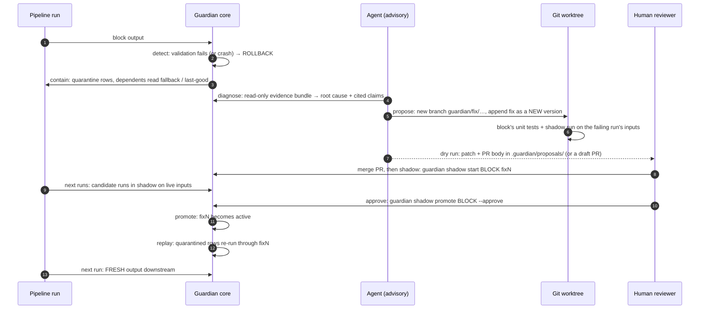

# The diagnosis and fix agent

Guardian contains a failure without help. Finding out why it happened, and fixing it,
is where an LLM agent helps. The agent is advisory: it reads Guardian's stores, writes
under `.guardian/diagnoses/` and `.guardian/proposals/`, and can at most open a draft
pull request. It never edits code in place, merges, or promotes.

## Diagnosis

`guardian diagnose <block> [--run <run_id>]` gathers the evidence for any block's run (by
default its latest ROLLBACK) and asks the model for a root cause.

### The evidence bundle

`guardian/agent/evidence.py` builds a bundle in which every item has a stable ID (E1,
E2, ...), and the model must cite these IDs. It contains the run's outcome, each failed
validation rule with its row count, a sample of the quarantined rows (20 by default,
`--sample-size`), and the output schema compared with the last good run and with the
declared schema. It also has the run's drift check if the block has a drift policy,
per-column stats for the good rows, the bad rows and the last good snapshot, and
whether the block's code changed since its last good run: every block run records a
fingerprint of the function that ran, and its source is kept in `.guardian/code/`, so
the bundle can show a diff. Finally it lists the git log and diff of the block's source
file since its last promotion, where each input came from and its quality, the block's
place in the DAG, and recent events for the block and its upstreams.

The same stored state always gives the same bundle. It is written to
`.guardian/diagnoses/<block>/<run_id>/evidence.json`, and `--evidence-only` stops there
without calling a model. Samples are capped and long text is cut before anything leaves
the machine. Values of every column listed in any block's `redact_columns` are masked
everywhere, including inside validation messages and events. Redaction covers the whole
pipeline because a column keeps its name as data flows downstream: the demo declares
emails in `b1_ingest` and `b4_clean`, and they are also masked in the evidence of
`b2_parse` and `b3_standardize`, which carry the same columns without declaring them.

### The answer and how it is checked

The model returns JSON with a `root_cause` (`upstream_data_drift`, `schema_change`,
`code_bug` or `unknown`), a `confidence` from 0 to 1, a `summary`, and `claims`, each
citing evidence IDs. The Anthropic client enforces this shape as a JSON-schema
structured output, and Guardian validates every answer anyway. Invalid JSON or a
malformed answer is retried once, then downgraded to `unknown` with the reason recorded.
A claim that cites an ID not in the bundle, or cites nothing, gets the whole answer
rejected: the diagnosis becomes `unknown` and the model's answer is kept as `proposed`,
for audit. A refusal or an API error is recorded as the diagnosis and never raised into
the pipeline. The result goes to `diagnosis.json` next to the evidence, with a DIAGNOSIS
event that is never sampled out.

### Configuration

The provider, model and key come from the environment, never from code:

| variable | meaning |
|---|---|
| `GUARDIAN_LLM_PROVIDER` | `anthropic`, or `fake` to replay recorded answers |
| `GUARDIAN_LLM_MODEL` | model name passed to the provider |
| `GUARDIAN_LLM_API_KEY_ENV` | name of the variable holding the key (default `ANTHROPIC_API_KEY`) |
| `GUARDIAN_LLM_FAKE_RESPONSES` | recordings file for the `fake` provider |
| `GUARDIAN_LLM_MAX_TOKENS`, `GUARDIAN_LLM_THINKING` | optional (defaults `16000`, adaptive thinking `on`) |

The Anthropic client uses the official SDK, an optional extra (`uv sync --extra agent`).
The `--provider`, `--model` and `--fake-responses` flags override the variables.

Add `auto_diagnose: true` to a block to diagnose it after every ROLLBACK, under either
runner: the hook lives in core and is called from `complete_block`. A diagnosis that
fails, for example because no provider is configured, is logged as a WARN event and the
run carries on as it would without it.

### Example: a bad deploy of b6_enrich

```
$ guardian run demo/pipeline.yaml --run-id r1
$ guardian run demo/pipeline.yaml --run-id r2 --fault b6_enrich:code_bug
$ guardian diagnose b6_enrich --evidence-only
┏━━━━━┳━━━━━━━━━━━━━━━━━━━┳━━━━━━━━━━━━━━━━━━━━━━━━━━━━━━━━━━━━━━━━━━━━━━━━━━━━━━━━━━━━━━━━━━━━━━━━━━━━━┓
┃ id  ┃ kind              ┃ item                                                                     ┃
┡━━━━━╇━━━━━━━━━━━━━━━━━━━╇━━━━━━━━━━━━━━━━━━━━━━━━━━━━━━━━━━━━━━━━━━━━━━━━━━━━━━━━━━━━━━━━━━━━━━━━━━━━┩
│ E1  │ run_outcome       │ b6_enrich on run r2: ROLLBACK                                            │
│ E2  │ validation_rule   │ rule order_size:isin(['small', 'medium', 'large']) failed on 222 row(s)  │
│ E3  │ validation_rule   │ rule region:isin(['NA', 'EU']) failed on 222 row(s)                      │
│ E4  │ quarantine_sample │ sample of 20 of 222 quarantined bad row(s)                               │
│ E5  │ schema_diff       │ output schema vs last good run and declared schema                       │
│ E6  │ column_stats      │ column order_id: good rows vs bad rows vs last good snapshot             │
│ ... │                   │                                                                          │
│ E17 │ code_change       │ the block's code on this run vs its last good run                        │
│ E18 │ git_history       │ git history of the block's source since its last promotion               │
│ E19 │ input             │ input b5_normalize: FRESH                                                │
│ E20 │ dag               │ b6_enrich's place in the DAG                                             │
│ E21 │ event             │ QUARANTINE event for b1_ingest on r1                                     │
│ ... │                   │                                                                          │
│ E40 │ event             │ ROLLBACK event for b6_enrich on r2                                       │
└─────┴───────────────────┴──────────────────────────────────────────────────────────────────────────┘
```

Two of those items, as written to `evidence.json` (trimmed):

```json
{"id": "E2", "kind": "validation_rule", "data": {"rule": "order_size:isin(['small', 'medium', 'large'])",
  "rows": 222, "fraction_of_output": 0.5011, "example_reasons": ["column 'region' failed isin(['NA', 'EU'])
  (value='EU '); column 'order_size' failed isin(['small', 'medium', 'large']) (value='large ')", ...]}}
{"id": "E17", "kind": "code_change", "data": {"changed": true, "last_good_run": "r1",
  "last_good": {"function": "guardian.demo.blocks:enrich", "fingerprint": "cbadb335608d8be1", ...},
  "this_run": {"function": "guardian.demo.refactor:rewrite.<locals>.block", ...},
  "diff": ["--- last good (guardian.demo.blocks:enrich)", "+++ this run (...)",
           "-    out[\"region\"] = out[\"country\"].map(REGION_BY_COUNTRY)", ...,
           "+                out.iloc[selected, j] = values.iloc[selected].map(",
           "+                    lambda v: v + \" \" if isinstance(v, str) else v", ...]}}
```

With a provider configured, `guardian diagnose b6_enrich` prints the answer below. This
answer is not model output: it is a hand-written recording replayed with
`--provider fake` to show the format, because no API key was available where this was
written. Replace it after a real run.

```
$ guardian diagnose b6_enrich
Diagnosis of b6_enrich on r2 (advisory, model illustration)
root cause: code_bug   confidence: 0.85   status: accepted
b6_enrich's code changed between r1 and r2; half its rows now carry padded category labels while its
input and output schema are unchanged.
┏━━━┳━━━━━━━━━━━━━━━━━━━━━━━━━━━━━━━━━━━━━━━━━━━━━━━━━━━━━━━━━━━━━━━━━━━━━━━━━━━━━━━━━━┳━━━━━━━━━━━━┓
┃ # ┃ claim                                                                           ┃ evidence   ┃
┡━━━╇━━━━━━━━━━━━━━━━━━━━━━━━━━━━━━━━━━━━━━━━━━━━━━━━━━━━━━━━━━━━━━━━━━━━━━━━━━━━━━━━━╇━━━━━━━━━━━━┩
│ 1 │ 222 of 443 rows fail region and order_size isin checks, with values like 'EU '  │ E1, E2, E3 │
│   │ and 'large '.                                                                   │            │
│ 2 │ The output has the same columns as the last good run.                           │ E5         │
│ 3 │ The function that ran differs from the one that produced r1.                    │ E17        │
│ 4 │ The input was a fresh, healthy b5_normalize snapshot.                           │ E19        │
└───┴─────────────────────────────────────────────────────────────────────────────────┴────────────┘
Evidence: .guardian/diagnoses/b6_enrich/r2/evidence.json
Diagnosis: .guardian/diagnoses/b6_enrich/r2/diagnosis.json
```

## The self-healing loop

`guardian propose <block> [--run <run_id>] [--open-pr]` proposes a fix, verifies it, and
at most opens a draft pull request. People decide everything after that:



### What propose does

The model answers with a fix plan that has to fit the diagnosed root cause:

| root cause | allowed fix |
|---|---|
| `code_bug` | `new_version`: a new function, added to the block's `versions` as `fix1`, `fix2`, … |
| `schema_change` | `schema_update` (a new schema object the block points to) or `adapter_update` (a new adapter on a fallback edge standing in for the block) |
| `upstream_data_drift` | `schema_update`, or `upstream_note`: a note for the upstream owner, no code |
| `unknown` | nothing: no fix is proposed |

The plan is checked like a diagnosis. Invalid JSON, a disallowed action, or code that
does not parse or rebinds an existing name is retried once, then rejected; a citation of
a nonexistent evidence ID is rejected at once. New code is only ever appended under a new
name, and a new version never replaces the live one, so a fix still has to earn its
promotion through shadow runs.

The plan is applied in a temporary `git worktree` on a new
`guardian/fix/<block>/<run>-<version>` branch. The definition is appended to the right
module and the spec is edited with its comments kept; every other block is checked to
be unchanged. The block's unit tests then run against the worktree's code. Each block
declares them in the spec (`tests:`), and the demo points every block at
`tests/demo/test_block_contracts.py`, which checks every version and fallback adapter on
clean data. A block without tests cannot get a fix. Next, the candidate runs on the
failing run's inputs (the snapshots the block actually read, or its reloaded source
data) and must pass validation under the block's shadow policy.

Only if both checks pass is the proposal `ready`. `--open-pr` then pushes the branch and
opens a draft pull request, with the token from `GITHUB_TOKEN` (or the variable named by
`GUARDIAN_GITHUB_TOKEN_ENV`) and the repository from the `origin` remote (or
`GUARDIAN_GITHUB_REPO`). Otherwise the attempt is recorded as `failed` with its reasons.
The default is a dry run, which never touches GitHub. Everything lands in
`.guardian/proposals/<block>/<run_id>/`: `proposal.json`, `patch.diff`, `pr_body.md` (or
`note.md`) and a copy of the patched file. The pull request body holds the diagnosis,
the cited evidence, the fix's rationale, the checks and shadow comparison, the commands
a reviewer runs after merging, and the patch.

### Example: fixing the bad deploy of b6_enrich

Both model answers here, the diagnosis and the fix plan, are recorded fakes; the tests,
the shadow run and the patch are real output.

```
$ guardian propose b6_enrich
Proposal for b6_enrich on r2 (root cause code_bug): ready
action: new_version   The failures start with the code change in E17 while the schema (E5) and
inputs are unchanged; restore the last good enrich logic as a new version.
new version: fix1 -> demo.blocks:enrich_fixed
unit tests: passed (pytest -q -p no:cacheprovider
tests/demo/test_block_contracts.py::test_block_contract[b6_enrich])
                               Shadow run on the failing run's inputs
┏━━━━━━━━━━━━━━━━━━━━━━━━┳━━━━━━━━━━━━━━━━━━━━━━━━━━━━━━━━━━━━┳━━━━━━━━━━━━━━━━━━━━━━━━━━━━━━━━━━━━┓
┃ metric                 ┃ live `v1` on r2                    ┃ candidate `fix1` (same inputs)     ┃
┡━━━━━━━━━━━━━━━━━━━━━━━━╇━━━━━━━━━━━━━━━━━━━━━━━━━━━━━━━━━━━━╇━━━━━━━━━━━━━━━━━━━━━━━━━━━━━━━━━━━━┩
│ outcome                │ ROLLBACK (bad-row fraction 0.5011  │ PASS                               │
│                        │ exceeds threshold 0.1)             │                                    │
│ rows out               │ 443                                │ 443                                │
│ bad rows               │ 222                                │ 0                                  │
│ pass rate              │ 49.9%                              │ 100.0%                             │
│ min pass rate (policy) │                                    │ 90.00%                             │
│ vs last good (r1)      │                                    │ 0 added, 0 removed, 0 changed      │
│                        │                                    │ (0.0%)                             │
└────────────────────────┴────────────────────────────────────┴────────────────────────────────────┘
`b6_enrich` is DEGRADED, so its shadow runs are in absolute mode: promotion needs an explicit
approval (`guardian shadow promote --approve`).
Proposal: .guardian/proposals/b6_enrich/r2
Dry run: GitHub was not touched. Re-run with --open-pr to open a draft PR.
```

The patch appends the new function and one line to the spec:

```diff
+def enrich_fixed(*args, **kwargs):
+    return enrich(*args, **kwargs)
...
       v_bad: demo.blocks:enrich_bad
+      fix1: demo.blocks:enrich_fixed
     active: v1
```

The fix restores the committed implementation because the fault was injected at run
time, which is what reverting a bad deploy looks like.
[`tests/scenarios/test_self_healing.py`](../tests/scenarios/test_self_healing.py) runs
this loop for every DAG role: detect, contain, diagnose, propose, then, as the human
reviewer, shadow the proposed version while the bug is still live, check that promotion
is refused without approval and succeeds with it, and check that the next run is FRESH
downstream.

### What the agent is not allowed to do

Each limit is enforced in `guardian/agent/safety.py` and tested in
`tests/agent/test_safety.py` and `tests/unit/test_layering.py`.

- It never promotes, shadows, rolls back, replays or changes a block's status. It only
  sees Guardian through `agent_view`, which raises on every state-changing method and on
  writes to the version, shadow, status, snapshot and quarantine stores. A static test
  checks that no agent module calls them; the eval harness is the one exception.
- It never merges. Its GitHub client can create a draft pull request and nothing else.
- It never pushes to the default branch. Its git wrapper allows a fixed list of
  subcommands, with no merge, rebase, pull, reset, checkout or cherry-pick, commits only
  on its own `guardian/fix/*` branches, and pushes only such a branch, to the same name,
  never forced.
- It never edits existing code. Definitions are appended under new names, and a patch
  that would remove or rebind anything is rejected.
- It never opens a pull request for a fix whose unit tests or shadow run failed, and
  never acts on an `unknown` diagnosis or on evidence that is not in the bundle.
- It never sees redacted data: everything it is sent comes from the evidence bundle.

## Evaluation

`guardian eval diagnose` builds one labeled case per block and fault type. It runs the
pipeline once cleanly, then, for each case, copies that state, injects the fault into
the block, re-runs it and builds the bundle:

| fault | what it does | label |
|---|---|---|
| `schema_drift` | renames a required column of the block's output | `schema_change` |
| `corrupt_rows` | writes invalid values into half the rows | `upstream_data_drift` |
| `null_burst` | nulls a non-nullable column in half the rows | `upstream_data_drift` |
| `code_bug` | swaps in a buggy rewrite of the block's function (new code, same input) | `code_bug` |

Columns are chosen from each block's clean output and declared schema, never by name.
Event timestamps and git history are left out of eval bundles, so the same case always
produces the same prompt. `guardian eval propose` runs on the `code_bug` cases only: it
diagnoses, proposes (always a dry run), then shadows and promotes the fix with approval
on a scratch copy of the case, as a reviewer would. Every number comes from these
synthetic injected faults, not from real incidents.

### Running it against a real model

Nothing calls a paid API unless `--real` is given. Without it the eval only runs on
recorded answers (`--provider fake --fake-responses FILE`), and it refuses to run when
`GUARDIAN_LLM_PROVIDER` names a real provider. Without the model name or the key,
`--real` stops with an error naming the missing variables.

```bash
uv sync --extra agent
export GUARDIAN_LLM_MODEL=<model>               # never hardcoded
export ANTHROPIC_API_KEY=...                    # or name another variable in GUARDIAN_LLM_API_KEY_ENV
export GUARDIAN_LLM_PRICE_INPUT_PER_MTOK=...    # USD per million tokens, for cost figures
export GUARDIAN_LLM_PRICE_OUTPUT_PER_MTOK=...

uv run guardian eval diagnose --dry-run --repeats 3     # cases, tokens and cost; no calls
uv run guardian eval diagnose --real --repeats 3
uv run guardian eval propose --dry-run
uv run guardian eval propose --real
uv run python bench/update_readme.py                    # fills the table below
```

| option | what it does |
|---|---|
| `--real` | use the real model (the only way to make paid calls) |
| `--dry-run` | print the number of cases, the estimated input and output tokens (expected, and an upper bound with every call retried at `max_tokens`) and the estimated cost, then exit without calling anything. Prices come from `GUARDIAN_LLM_PRICE_*_PER_MTOK` or `--price-input` / `--price-output`; they are never hardcoded. Input tokens are estimated from the exact prompts at 3.5 characters per token; output from `--expected-output-tokens` (default 2000 per call, thinking included) |
| `--max-cases N`, `--roles R`, `--faults F`, `--block B` | narrow the cases. `--max-cases` keeps a sample drawn with `--seed` (default 0), and the seed also drives fault injection, so the same arguments always give the same cases |
| `--repeats K` | run every case K times and report agreement across repeats |
| `--no-cache`, `--cache-dir` | with `--real`, every answer is stored on disk (default `.guardian/llm-cache`, or `$GUARDIAN_LLM_CACHE_DIR`), keyed by model, prompt hash and repeat number. A re-run or an interrupted run resumed later pays only for calls it has not made yet, and `--dry-run` counts only those. `--no-cache` calls the model again (and stores the new answers) |
| `--record FILE` | also save the answers of the calls made, for replay with `--provider fake` |

For every case and repeat, `eval diagnose` records the predicted root cause, the stated
confidence, whether the citations validated, the latency and the tokens. It reports
accuracy overall, by DAG role and by fault type, a confusion matrix, accuracy by
confidence bucket with the expected calibration error, the citation-rejection rate,
median latency, and total tokens and cost. `eval propose` reports the fix-success rate
overall and by role, with failures grouped by reason: misdiagnosed, diagnosis not
trusted, no usable plan, unit tests failed, shadow check failed, promotion refused.

Both commands write their own section of `bench/agent_eval.json`; `bench/agent_eval.md`
is rendered from it with the model, date, git commit and case count, and
`bench/update_readme.py` fills the README's agent-eval table from it, refusing sections
made from recorded answers. In pytest the eval only runs against `FakeClient`. The tests
check that every case really fails and carries the evidence that separates its label,
that the metrics match an independent tally of scripted answers, and the cache, the
`--real` gate, the dry-run counts and redaction: a test replays every fault type through
the cache and checks that no redacted value appears in any cached prompt.
